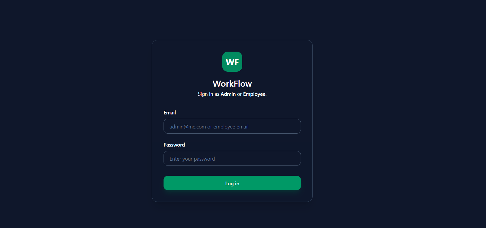
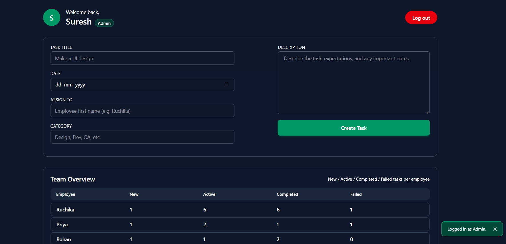
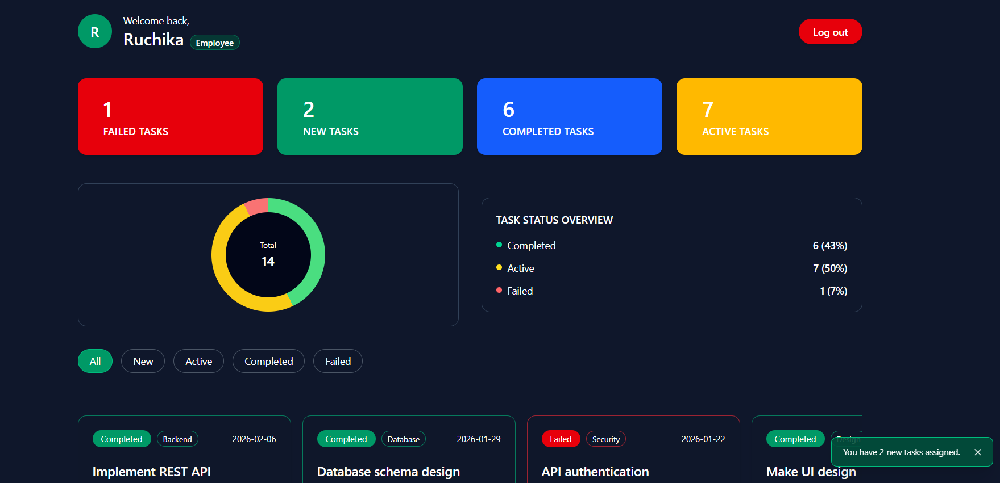
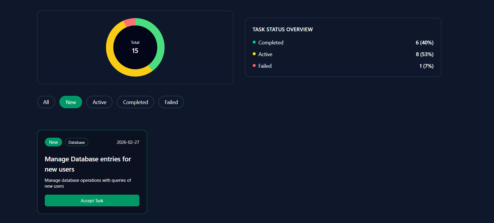
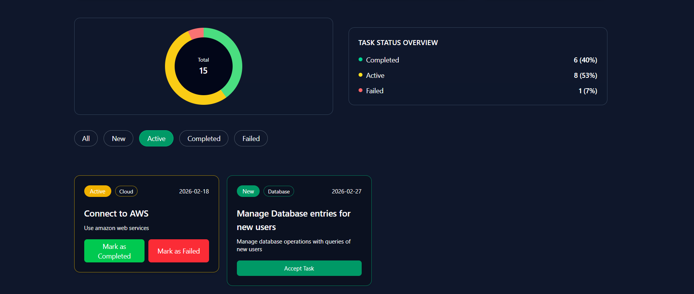
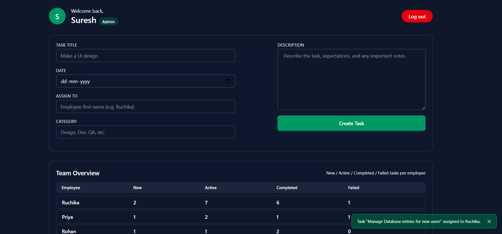

# 🚀 Workflow – Employee Task Management System

Workflow is a role-based task management application built using React.  
It provides separate dashboards for Admin and Employees, allowing structured task assignment, tracking, and management.

The application uses React Context API for global state management and Local Storage for data persistence.

## 🔐 Role-Based Access

- **Admin Dashboard**
  - Assign tasks to employees
  - Track task distribution
  - Monitor task status overview

- **Employee Dashboard**
  - View assigned tasks
  - Filter tasks (New, Active, Completed, Failed)
  - Update task status
  - Visual task statistics (Pie Chart)

## 🛠️ Tech Stack

- React
- Context API
- JavaScript (ES6+)
- Tailwind CSS
- Local Storage
- Vite

## ✨ Features

- Role-based authentication (Admin / Employee)
- Dynamic task assignment
- Task status management system
- Real-time UI updates using Context API
- Persistent storage using Local Storage
- Interactive dashboard with visual statistics
- Responsive modern UI

## 📸 Screenshots

### 🔑 Login Page

### 👨‍💼 Admin Dashboard

### 👩‍💻 Employee Dashboard

### 🆕 New Tasks

### ✅ Active Tasks

### 📌 Task Assigned

